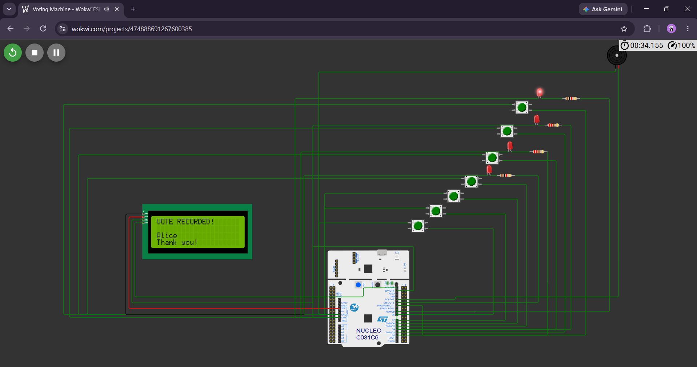
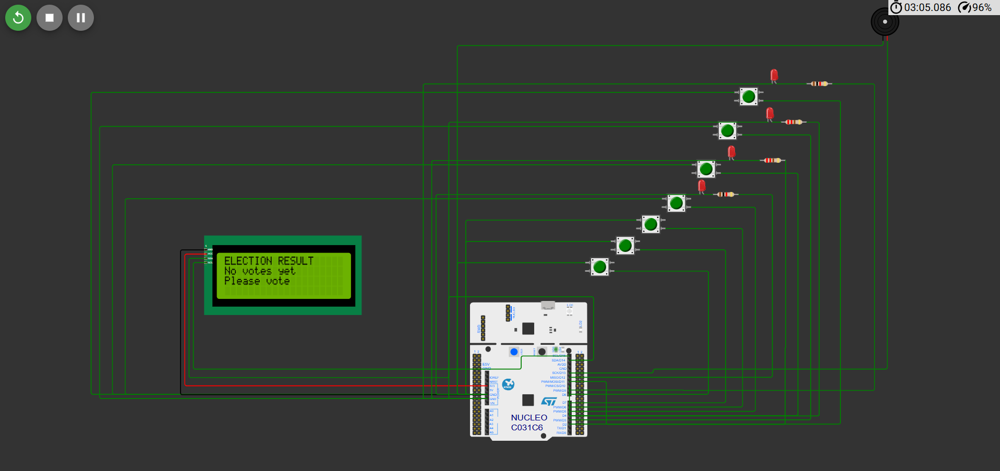

Electronic Voting Machine Using STM32

📌 Project Overview

This project implements a simple Electronic Voting Machine using the STM32 Nucleo C031C6 microcontroller.

The system uses push buttons to record votes for four candidates and displays voting information and results on a 20×4 I2C LCD. LEDs and a buzzer provide visual and audio feedback.

The complete system was designed and tested using the Wokwi simulation platform.

✨ Features

- Candidate-wise vote recording
- Automatic vote counting
- 20×4 I2C LCD display
- LED indication for candidate selection
- Buzzer feedback after voting
- Winner detection
- Tie detection
- Total vote calculation
- Election reset functionality
- Button-release handling to prevent repeated votes

🛠️ Components Used

- STM32 Nucleo C031C6
- 20×4 I2C LCD
- 7 Push Buttons
- 4 LEDs
- 4 × 220Ω Resistors
- Buzzer
- Jumper Wires
- Wokwi Simulation Platform

🔌 Pin Configuration

| Component | STM32 Pin |
|---|---|
| Candidate A | D2 |
| Candidate B | D3 |
| Candidate C | D4 |
| Candidate D | D5 |
| Winner Button | D6 |
| Vote Count Button | D7 |
| Reset Button | D8 |
| LED A | D9 |
| LED B | D10 |
| LED C | D11 |
| LED D | D12 |
| Buzzer | D13 |
| LCD SDA | D14 / SDA |
| LCD SCL | D15 / SCL |

⚙️ Working Principle

1. The system initializes the STM32, LCD and connected components.
2. The voter selects a candidate using the corresponding push button.
3. The STM32 detects the button press and increments the candidate's vote count.
4. The corresponding LED provides visual feedback.
5. The buzzer provides audio confirmation.
6. The Vote Count button displays individual candidate votes and total votes.
7. The Winner button determines the candidate with the highest number of votes.
8. If multiple candidates have the same highest vote count, a tie is displayed.
9. The Reset button clears all recorded votes.

📸 Screenshots

 Vote Recorded

Vote Count

Winner Detection

Tie Detection

Reset Functionality

No Votes Condition

💻 Software

- Programming Language: C/C++ (Arduino framework)
- Simulation Platform: Wokwi
- Microcontroller: STM32 Nucleo C031C6
- Communication Protocol: I2C

🚀 Future Scope

- Voter authentication
- Secure vote storage
- EEPROM/external memory integration
- Password-based administrator access
- Keypad or biometric authentication
- Implementation on physical STM32 hardware

👩‍💻 Project

Developed as an academic mini-project to demonstrate practical concepts of embedded systems, GPIO interfacing, I2C communication and microcontroller programming.
